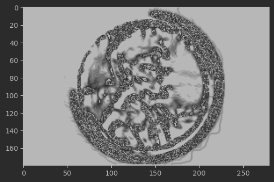
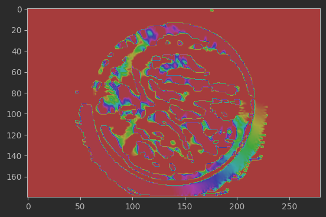
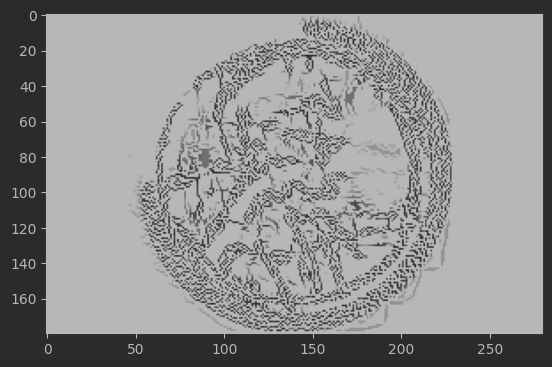
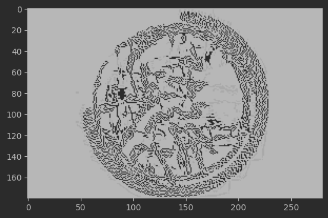
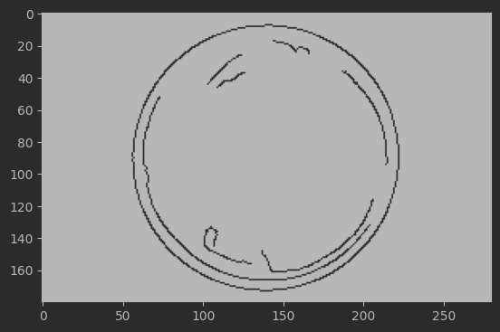
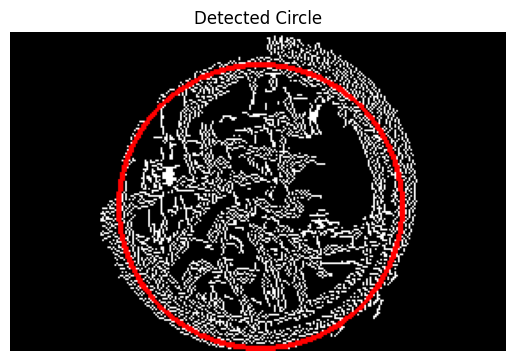
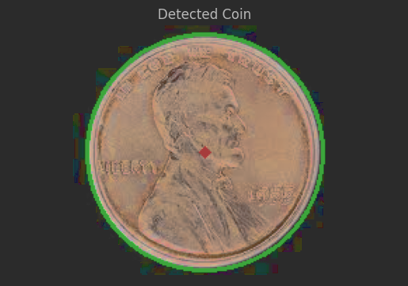

# 作业一：Canny边缘检测、Hough圆检测算法 Python实现
- author by 2021213368张瀚墨

**工作内容：**
1. 使用OpenCV官方库完成，演示效果
2. 自行编写实现Canny算法和HoughCircle算法，并演示效果

使用的硬币图片：

## 一、Canny算法
算法流程与函数功能

Canny算法实现分为以下几个步骤：
1. 计算图像梯度, `compute_gradients(image) -> magnitude, angle`
    功能：使用纵向和横向的Sobel算子分别对图像进行卷积，以计算图像梯度的幅度值和方向。
    输入参数：image —— 待处理的图像。
    输出：图像梯度的幅度magnitude和方向angle。
    结果展示：
    幅度magnitude:

    

    方向angle:

    

2. 非极大值抑制(Non-max-suppression NMS), `non_max_suppression(magnitude, angle) -> Z`

    功能：在梯度幅度图中抑制非边缘像素，确保边缘细化至1像素宽度。
    输入参数：magnitude, angle —— 梯度幅度和方向。
    输出：细化后的边缘图像Z。

    

3. 双阈值, `double_threshold(H, lowThresholdRatio=0.09, highThresholdRatio=0.40) -> res, weak, strong`
    功能：定义高低阈值，将梯度幅度分为强边缘、弱边缘和非边缘三类。
    输入参数：
    Z —— 非极大值抑制后的图像。
    lowThresholdRatio、highThresholdRatio —— 低阈值比例和高阈值比例。
    输出：经过阈值处理的边缘图res，弱边缘和强边缘图像。

4. 过滤强边缘和与强边缘连接的弱边缘, `edge_tracking_by_hysteresis(edges, weak, strong=255) -> edges`
    功能：根据强边缘连接弱边缘，过滤出真正的边缘。
    输入参数：edges —— 双阈值处理后的边缘图，weak和strong —— 弱边缘和强边缘的标识。
    输出：最终的边缘检测结果图像edges。

    

总结：Canny边缘检测的流程可以大致分为以下几个步骤：
1. 计算图像梯度（这里使用Sobel算子，也可以用高斯偏导等算子）
2. NMS非极大值抑制
3. 双阈值过滤

**- 参数对边缘提取的效果影响：**
  
    梯度计算： 梯度方向和幅度的准确计算对后续步骤至关重要。
    非极大值抑制： 直接影响边缘的细化程度。
    双阈值处理： 低高阈值的选择对强边缘与弱边缘的分类有显著影响，进而影响最终边缘的检测效果。
    边缘跟踪： 确定了最终边缘的形成，对结果的完整性和准确性起决定性作用。

使用OpenCV`cv2.Canny`实现的效果：

## 二、HoughCircle算法
1. 遍历每一个像素，在圆的Hough空间进行投票
    功能：对于每个边缘像素点，根据可能的圆心位置和半径，在Hough空间进行投票。
    输入参数：边缘检测后的图像。
    输出：Hough空间的累加器数组。

2. 取最大的投票(x, y, r)作为找到的圆
    注意：考虑到性能和演示的目的，我们这里限定圆的半径在一个较小的范围内
    这里我们只查找最明显的圆，因此只查看累加器中的最大值
    功能：在Hough空间中寻找投票数最多的点，确定圆心坐标和半径。
    输入参数：Hough空间的累加器数组。
    输出：圆心坐标和半径。

**- 参数对于Hough圆检测影响**

边缘图像的质量： 直接影响Hough圆检测的准确性。
Hough空间的细粒度： 决定了圆心定位和半径

使用OpenCV`cv2.HoughCircle`实现的效果：

